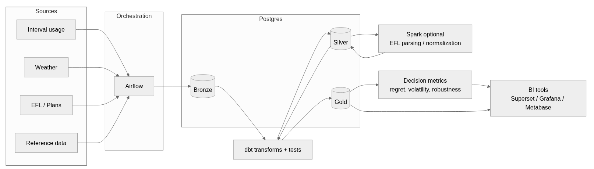

# ERCOT Lakehouse Demo

Many websites help you compare plans, but they are black boxes. 
I wanted a small, transparent pipeline where I can plug in my own assumptions (usage profile, weather scenario, and ranking rule) and get a ranked recommendation.

Why? Two plans can show the same “¢/kWh” headline, but the bill changes a lot depending on:
- how your usage is distributed across the month (and across days)
- fixed monthly charges
- tiered pricing, bill credits, minimum usage rules
- delivery charges (TDU) and other fees
- weather (a hot month can completely change the outcome)

**The core problem:** you can’t really choose “the best plan” without simulating costs against a realistic usage profile and checking how that choice behaves in different conditions (normal vs hot vs extreme).

This repo is my portfolio-friendly starting point for that idea.

It’s intentionally small and public-safe, but shaped like a real data project: inputs, transformations, and a reproducible output you can run locally in seconds. The roadmap points to where this grows into a production-style lakehouse pipeline.

---

## What this repo implements (today)

This repo includes a runnable MVP that:

- reads a sample 15-minute usage profile (or your own smart-meter interval usage from your provider/utility portal)
- reads a few sample plans (flat rate + fixed monthly charge; you can get this info from the official Electricity Facts Label / EFL)
- reads sample weather (historical daily data). The demo uses CDD (Cooling Degree Days), which often correlates with cooling demand
- estimates plan cost in two scenarios:
  - **normal** usage: baseline usage (no scaling)
  - **hot** usage: baseline usage scaled up using the hottest CDD day in the sample weather period
- ranks plans using the **hot** scenario cost (a simple risk-averse choice: it favors plans that stay cheaper when usage increases)
- writes `reports/demo_ranking.csv` (one row per plan, including normal vs hot cost, plus `cdd_baseline`, `cdd_hot`, and `hot_factor`)

This is not “full ERCOT billing math” yet. It’s the smallest version that proves the workflow end-to-end and leaves room for realistic plan logic.

---

## Quick start

    python3 src/demo_rank.py

Output:
- `reports/demo_ranking.csv` (one row per plan, with normal vs hot costs)

---

## How the “hot” scenario works (simple on purpose)

The demo uses daily `cdd_65` values from `data/sample/weather_daily.csv`.
If your weather source doesn’t include CDD, you can compute it as:

    cdd_65 = max(0, avg_temp_f - 65)

65°F is a common convention for degree-day analysis in the US. It’s a baseline that approximates when cooling demand starts increasing. Different buildings and regions may use different bases (for example 68°F). 

- baseline CDD (cdd_baseline) = average CDD across the sample
- hot CDD (cdd_hot) = maximum CDD in the sample
- usage hot factor (hot_factor) = `1 + 0.03 * (cdd_hot - cdd_baseline)` (clamped to at least 1.0)

This is a transparent placeholder for a more realistic weather normalization model (regression vs CDD, rolling windows, station selection, etc.).

---

### How the demo works (step-by-step)

1) Load a synthetic sample 15-minute usage file and sum kWh to get a baseline usage amount.  
2) Load a sample plan list (flat energy rate + fixed monthly charge).  
3) Load a sample weather file with daily `cdd_65` values (Cooling Degree Days, base 65F).  
4) Build two scenarios:
   - **normal**: usage factor = 1.0
   - **hot**: usage factor =  `max(1.0, 1 + 0.03 * (cdd_hot - cdd_baseline))`
5) Estimate plan cost for both scenarios and rank plans by **hot** cost.  
6) Write the ranked results to `reports/demo_ranking.csv`.

### demo_ranking.csv columns

- `plan_id`  
  Short identifier of the plan (from `data/sample/plans.csv`).

- `plan_name`  
  Human-readable plan name.

- `total_kwh_sample`  
  Total kWh summed from the sample interval usage file (currently 1 week of 15-min intervals)..

- `cdd_baseline`  
  Average `cdd_65` across the sample weather period.

- `cdd_hot`  
  Maximum `cdd_65` observed in the sample weather period (used as the “hot” scenario).

- `hot_factor`  
  Multiplier applied to baseline usage to simulate a hotter period:
  `hot_factor = max(1.0, 1 + 0.03 * (cdd_hot - cdd_baseline))`.

- `energy_rate_per_kwh`  
  Flat energy rate in $/kWh for the plan (sample data input).

- `fixed_monthly_charge`  
  Fixed monthly charge in $ for the plan (sample data input).

- `estimated_cost_normal_usd`  
  Estimated cost using baseline usage (normal scenario).

- `estimated_cost_hot_usd`  
  Estimated cost using scaled usage (hot scenario).
---

## Repo tour

- `data/sample/`  
  Tiny synthetic datasets (usage, plans, weather). Public-safe by design.

- `src/demo_rank.py`  
  Computes normal and hot costs, ranks plans, writes the report.

- `reports/`  
  Generated output (kept small so the repo shows a real result).

- `docs/architecture.md`  
  Two diagrams:
  - **Current MVP** (what runs today)
  - **Target state** (Kafka + Airflow + Postgres bronze/silver/gold + dbt + optional Spark + dashboards)

---

## Where this goes next (roadmap)

**Pricing realism**
- delivery charges (TDU), fees, taxes
- tiers, usage credits, minimum usage rules
- time-of-use and seasonal pricing
- normalize EFL plan text into a canonical pricing schema

**Better decision-making**
- worst-case regret across scenarios (normal vs hot vs extreme)
- volatility / robustness scoring
- rolling 12-month evaluation and price-state comparisons

**Production shape**
- Postgres Bronze/Silver/Gold layers
- dbt models + tests (uniqueness, not null, freshness)
- audits, backfills, observability
- Airflow orchestration (and optionally Kafka for event-driven ingestion)

**Operational add-ons**
- Data refresh (download usage + weather on a schedule)  
- Visual checks (Grafana charts for usage and temperature)
- Optional automation (Home Assistant integration) 

---

## Screenshot

Target-state architecture diagram:

