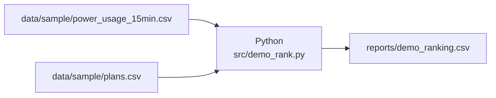
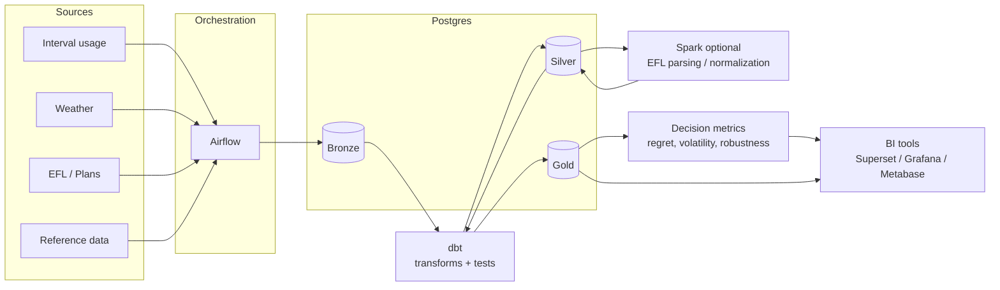

# Architecture

This repo shows two views of the same idea:

1) **Current MVP**: what you can run right now
2) **Target state**: where this naturally grows if you keep building

The MVP is deliberately simple so it’s easy to understand. The target state is the “grown-up” version you’d build on a team.

---

## 1) Current MVP (today)

**What it’s for:** take a usage profile, compare plans, and rank by normal vs hot scenario cost.

**Flow**
- Read sample 15-min usage
- Read sample plans
- Compute a simple cost per plan (flat rate + fixed charge)
- Write a ranked CSV report

**What’s missing (on purpose)**
- tiers, usage credits, minimum usage
- TDU charges, taxes/fees
- time-of-use pricing
- deeper weather normalization (fit usage vs CDD, seasonal effects, station selection)
- regret/robustness metrics

---

## 2) Target state (next evolutions)

**What it’s for:** model plans realistically and compute decision metrics, using a layered lakehouse pattern.

### Components (plain language)
- **Sources:** interval usage, weather, EFL plan documents, reference data
- **Airflow:** runs ingestion, refreshes, and backfills
- **Postgres layers**
  - **Bronze:** raw ingests, append-only + audit columns
  - **Silver:** cleaned and conformed entities (usage, weather, plans)
  - **Gold:** analytics-ready marts (monthly costs, rankings, metrics)
- **dbt:** transformations + tests + docs
- **Spark (optional):** heavy step (example: EFL parsing / pricing normalization)
- **BI tools:** Superset / Grafana / Metabase

### Data flow

---

## 3) Roadmap mapping (MVP → target)

- Pricing realism: tiers, credits, TOU, TDU, fees, taxes
- Scenarios: normal vs hot vs extreme, rolling windows
- Metrics: worst-case regret, average regret, robustness
- Ops: audits, backfills, tests, freshness checks, observability
- Delivery: dashboards and optional API endpoints
